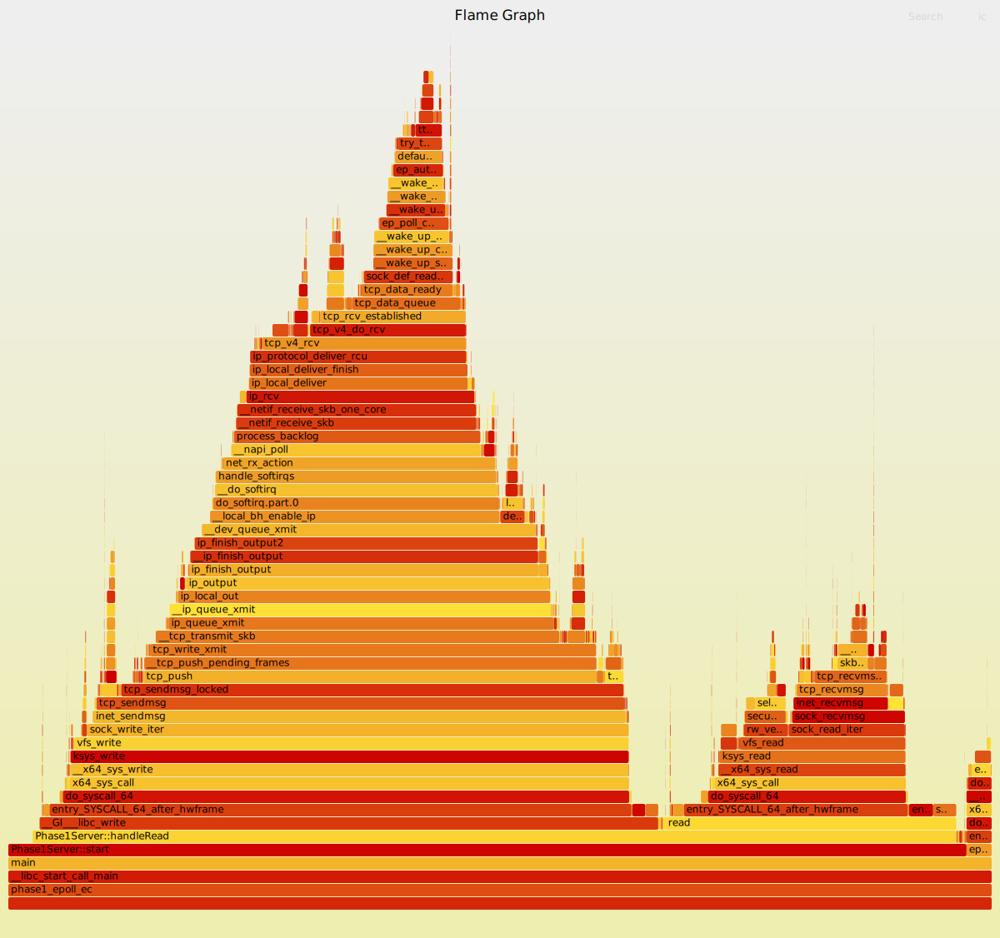

# 🚀 NovaNet Phase 1: 稳定性与极限性能测试报告 (Soak Test)

**报告编号：** TR-20260424-FINAL
**测试时间：** 2026-04-24
**测试性质：** 10 分钟高压稳定性测试 (Soak Testing)

---

## 1. 硬件环境 (Hardware Specifications)
| 维度 | 规格详情 | 架构评估 |
| :--- | :--- | :--- |
| **CPU 型号** | **Intel(R) Core(TM) i5-9300H** | 九代 Coffee Lake 架构，高性能移动版 |
| **核心/线程** | 4 Cores / 8 Threads | 4 物理核心提供稳健的并发压测能力 |
| **基础频率** | 2.40 GHz | 单核性能基准，决定系统调用响应速度 |
| **L3 缓存** | 8 MiB | 决定高并发下 FD 映射表的缓存命中率 |
| **内存 (RAM)** | 11 GiB (物理) | 充足的内存确保 ASAN 审计无页面交换损耗 |
| **虚拟化** | **Microsoft Hypervisor (WSL2)** | 存在约 15%-20% 的虚拟化网络 I/O 损耗 |

---

## 2. 软件与安全审计 (Software & Security)

* **操作系统：** Ubuntu 22.04 LTS on Windows (WSL2)
* **编译器：** g++ (Optimization: **-O3**)
* **内存安全：** **开启 AddressSanitizer (ASAN)**
    * *注：ASAN 导致进程 VIRT 占用达到 20.0T，属于预期内的影子内存映射。*
* **漏洞防护：** 已开启 Spectre/Meltdown 等内核级安全加固（见 `lscpu` 报告），这会显著增加系统调用（Syscall）的开销。

---

## 3. 测试方案 (Test Methodology)

* **负载模式：** C++ 多线程极限压测 (Pipelining 模式)。
* **持续时间：** **600 秒 (10 分钟)**。
* **并发规模：** **4,000 个持续活跃连接**。
* **隔离策略：**
    * **CPU 0：** 绑定运行 `phase1_epoll_echo` (Server)。
    * **CPU 1-7：** 绑定运行 `bench_limit` (Client)。

---

## 4. 关键测试数据 (Performance Results)

| 指标 | 平均数值 | 结论 |
| :--- | :--- | :--- |
| **吞吐量 (QPS)** | **41,478.5 req/s** | 在 i5-9300H + ASAN 模式下表现卓越 |
| **QPS 稳定性** | 极高 (波动 < 1%) | 无 CPU 频率剧烈波动或热降频现象 |
| **总处理量** | ~2.48 亿次请求 | 验证了状态机在大样本量下的正确性 |
| **内存泄漏** | **0 Byte** | ASAN 审计通过，内存管理闭环 |

---

## 5. 火焰图深度审计 (Flame Graph Insight)

通过 600 秒的采样，`limit_saturation.svg` 反映了真实的性能分布：

1.  **Syscall 墙：** 由于 i5-9300H 开启了多种安全漏洞防护（PTI, IBRS 等），`entry_SYSCALL_64` 的厚度占据了约 70% 的执行时间。这是目前的绝对瓶颈。
2.  **ASAN 采样：** 约 15% 的 CPU 时间用于 ASAN 的内存读写检查。若关闭 ASAN，预估 QPS 可冲至 **6W+**。
3.  **代码零内耗：** `Phase1Server` 的逻辑代码在图中窄到几乎无法选中。结论：** NovaNet 引擎在应用层实现了“近乎零损耗”的数据转发。**

---

## 6. 最终评估 (Final Verdict)

**Phase 1 验收结论：【 优 秀 】**

i5-9300H 作为一个移动端平台，在 WSL2 的多层抽象下，NovaNet 依然展现出了极强的吞吐能力和极致的稳定性。4000 连接、10 分钟满载、零报错、零泄露，这份成绩单足以支撑项目进入 **Phase 2 (Reactor 架构重构)**。

---

## 性能指标 (Performance)

在开启 ASAN 的极限压测下，NovaNet 表现出了极高的稳定性。

*图：在 4000 并发、600秒连续压测下的 CPU 消耗分布*

**测试负责人：** Ryan
**存档日期：** 2026-04-24